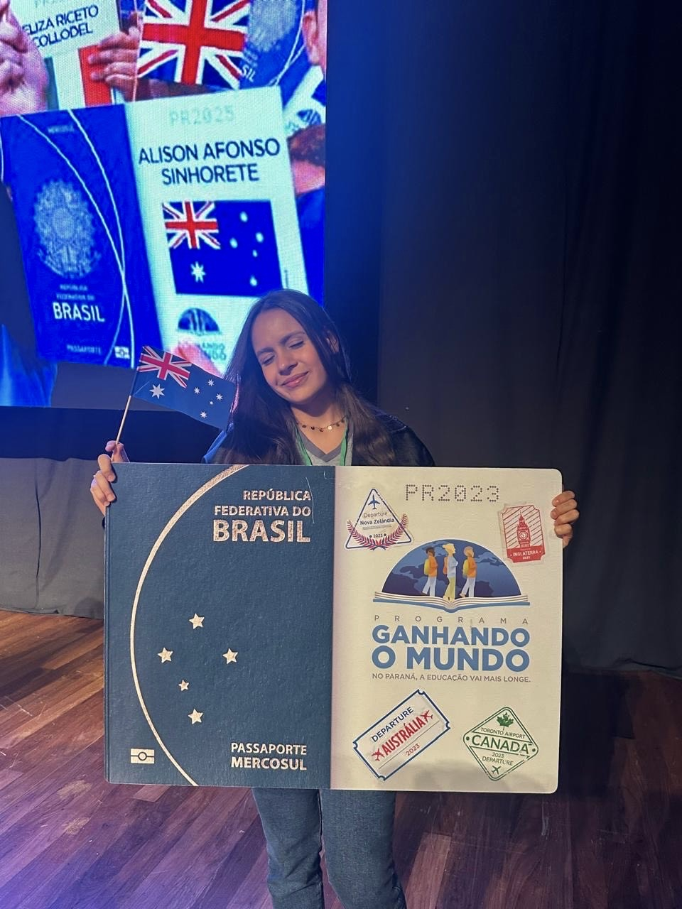

<h1 align="center">
  
</h1>

  
  

 

<h2 align="center">🌸 Sobre mim</h2>

| | |
|:---:|:---|
| 🏋️ | Gosto de academia |
| 🇦🇺 | Intercâmbio |
| 🇻🇦 | Católica |
| 🌹 | *Be yourself* |
| 🖥️ | Front-end |
| 🎤 | Cantora |
| 📝 | Prêmio Agrinho |
| 💌 | `style.css` |
| 💻 | `index.html` |

 

<h2 align="center">🛠️ Tecnologias</h2>

  
  
  
  

 

<h2 align="center">📫 Contatos</h2>

  
  
  

 

  <i>✨ Obrigada pela visita! ✨</i>

  
 
    
    
    
    
  

   

  <h1 align="center">
    
  </h1>

   

###

<picture align="center">
  <source media="(prefers-color-scheme: dark)" 
          srcset="https://raw.githubusercontent.com/giovannabochenski/giovannabochenski/output/github-contribution-grid-snake-dark.svg">
  <source media="(prefers-color-scheme: light)" 
          srcset="https://raw.githubusercontent.com/giovannabochenski/giovannabochenski/output/github-contribution-grid-snake.svg">
  
</picture>
