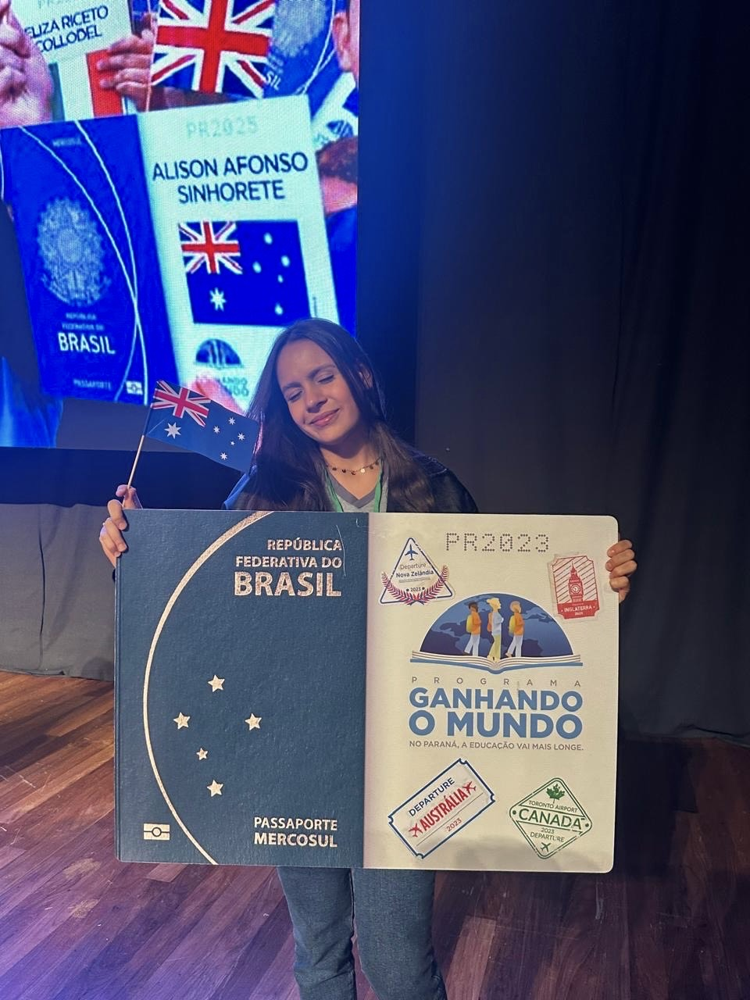

<h1 align="center">

</h1>

  
  

 
- 🏋️ Gosto de academia
 
 
- 🇦🇺 intercâmbio
 
 
- 🇻🇦 católica
 
 
- 🌹 Be yourself 
 
 
- 🖥 Front-end
 
 
- 🎤 cantora 
 
 
- 📝 prêmio agrinho
 
 
- 💌 style.css
 
 
- 💻  index.html

 

 
Contatos
 
 

  
 
  
  

 
<h1 align="center">

</h1>

###

###
